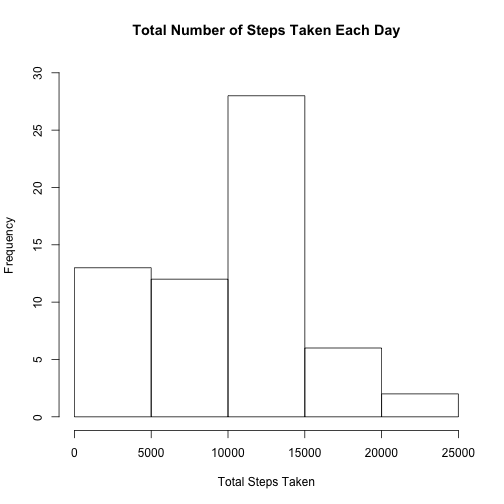
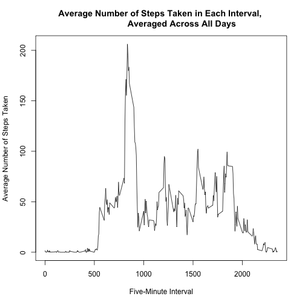
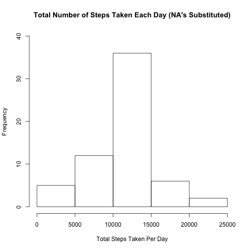
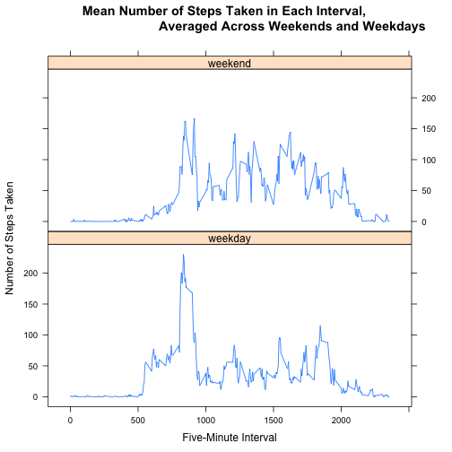

## Loading and preprocessing the data

1. & 2. The activity.zip file was placed in the working directory, and was unzipped
using the following code.

```r
unzip("activity.zip")
```

The data was then loaded and processed. 
This processing involved changing the date column to a date class variable.

```r
activity_dataset <- read.csv("activity.csv")
activity_dataset$date <- as.character(activity_dataset$date)
activity_dataset$date <- as.Date(activity_dataset$date, format = "%Y-%m-%d")
```


## What is mean total number of steps taken per day?

1. The histogram below shows the frequencies of the total number of steps 
taken a day.


```r
### Sum the number of steps per day and amend variable names 
library(plyr)
total_steps <- function(x) sum(x$steps, na.rm = TRUE)
total_steps_per_date <- ddply(activity_dataset, .(date), total_steps)
fix_column_names <- c("Date", "Steps")
colnames(total_steps_per_date) <- fix_column_names

### Generate histogram of number of steps taken per day
hist(total_steps_per_date$Steps, main = "Total Number of Steps Taken Each Day", 
     xlab = "Total Steps Taken", ylab = "Frequency", ylim = c(0, 30))
```

 

2. The following code calculates the mean and median total number of steps per day.


```r
### Calculate and report mean and median total number of steps per day
mean_per_day <- mean(total_steps_per_date$Steps)
median_per_day <- median(total_steps_per_date$Steps)
```

The mean total number of steps taken per day was 9354.2295082.

The median total number of steps taken per day was 10395.


## What is the average daily activity pattern?

1. The time series plot below shows the average number of steps taken per 5-minute 
interval, averaged across all days.


```r
## Average the number of steps in each interval, averaged across all dates
library(plyr)
mean_steps <- function(x) mean(x$steps, na.rm = TRUE)
mean_steps_per_interval <- ddply(activity_dataset, .(interval), mean_steps)
fix_col_names <- c("Interval", "Steps")
colnames(mean_steps_per_interval) <- fix_col_names

### Generate time series plot of average steps in an interval, averaged across 
### all dates
plot_avg_steps_interval <- plot(type = "l", x = mean_steps_per_interval$Interval, 
                 y = mean_steps_per_interval$Steps, 
                 main = "Average Number of Steps Taken in Each Interval, 
                 Averaged Across All Days",
                 xlab = "Five-Minute Interval", 
                 ylab = "Average Number of Steps Taken")
```

 

2. The following code finds the interval with the maximum number of steps.

```r
### Find interval with the largest average steps
interval_largest_avg_steps <- mean_steps_per_interval[which.max(mean_steps_per_interval$Steps),]
interval_largest_avg_steps
```

```
##     Interval    Steps
## 104      835 206.1698
```

The 5-minute interval, when averaged across all days in the dataset, with the 
maximum number of steps is 835.


## Inputing missing values

1. The following code calculates the number of missing values in the dataset.


```r
###Calculate and report the number of missing values in the dataset
count_na <- sum(is.na(activity_dataset))
```

The total number of missing values in the dataset is 2304.

2. & 3. The missing values in the dataset were filled in with the mean number 
of steps in the respective 5-minute interval, taken across all days. A new 
dataset was also created with these missing values filled. The code to do both 
of these steps is shown below.


```r
activitydata_NA_sub <- activity_dataset
activitydata_NA_sub$steps[which(is.na(activitydata_NA_sub$steps))] <- 
        mean_steps_per_interval$Steps[match(activitydata_NA_sub$interval
                                            [is.na(activitydata_NA_sub$steps)], 
                                            mean_steps_per_interval$Interval)]
```

4. The histogram below shows the total number of steps taken per day using the 
filled in dataset.


```r
### Calculate total steps per day across interval
library(plyr)
total_steps_NAsub <- function(x) sum(x$steps, na.rm = TRUE)
total_steps_date_NAsub <- ddply(activitydata_NA_sub, .(date), total_steps_NAsub)
fix_column_names <- c("Date", "Steps")
colnames(total_steps_date_NAsub) <- fix_column_names

### Generate histogram of total steps per day
hist(total_steps_date_NAsub$Steps, main = "Total Number of Steps Taken Each Day (NA's Substituted)", 
     xlab = "Total Steps Taken Per Day", ylab = "Frequency", ylim = c(0, 40))
```

 

The following code calculates the mean and median total number of steps per day 
using this filled in dataset.


```r
## Calculate mean and median steps per day
mean_per_day_NAsub <- mean(total_steps_date_NAsub$Steps)
mean_per_day_NAsub
```

```
## [1] 10766.19
```

```r
median_per_day_NAsub <- median(total_steps_date_NAsub$Steps)
median_per_day_NAsub
```

```
## [1] 10766.19
```

Using this calculation, the mean total number of steps taken per day was 
10766.19. This value is higher than the mean when missing values
were ignored.

Using this calculation, the mean total number of steps taken per day was 
10766.19. This value is higher than the mean when missing values
were ignored. 

The impact of inputting missing values is that the mean and median total steps
per day become equivalent, and are increased or inflated than when missing 
values are ignored.


## Are there differences in activity patterns between weekdays and weekends?

1. The following code creates a new factor variable in the dataset with two levels,
'weekday' and 'weekend'.


```r
### Change dates into day of the week names, then bind to dataframe
dataset_days <- activitydata_NA_sub
day_name <- weekdays(dataset_days$date)
dataset_days_comb <- cbind(dataset_days, day_name)

### Change those day of the week names to "weekday" or "weekend"
dataset_days_comb$day_name <- as.character(dataset_days_comb$day_name)
dataset_days_comb$day_name[dataset_days_comb$day_name == "Monday"] <- "weekday"
dataset_days_comb$day_name[dataset_days_comb$day_name == "Tuesday"] <- "weekday"
dataset_days_comb$day_name[dataset_days_comb$day_name == "Wednesday"] <- "weekday"
dataset_days_comb$day_name[dataset_days_comb$day_name == "Thursday"] <- "weekday"
dataset_days_comb$day_name[dataset_days_comb$day_name == "Friday"] <- "weekday"
dataset_days_comb$day_name[dataset_days_comb$day_name == "Saturday"] <- "weekend"
dataset_days_comb$day_name[dataset_days_comb$day_name == "Sunday"] <- "weekend"
dataset_days_comb$day_name <- as.factor(dataset_days_comb$day_name)
```

2. The following panel plot shows a time series plot of the average number of
steps taken per day across each 5-minute interval, averaged across all weekend
and weekday days.


```r
### Calculate the average of the number of steps in each interval, averaged 
### across the weekend or weekday values
library(plyr)
mean_steps <- function(x) mean(x$steps)
mean_steps_per_interval_day <- ddply(dataset_days_comb, .(interval, day_name), mean_steps)
fix_names <- c("Interval", "Day_Name", "Steps")
colnames(mean_steps_per_interval_day) <- fix_names

### Generate time series plot of average steps in an interval, averaged across all dates
library(lattice)
plot_avg_steps_interval_day <- xyplot(Steps ~ Interval | Day_Name, 
                                      data = mean_steps_per_interval_day, 
                                     layout = c(1, 2), type = "l", 
                                      main = "Mean Number of Steps Taken in Each Interval, 
                                     Averaged Across Weekends and Weekdays", 
                                      xlab = "Five-Minute Interval", 
                                    ylab = "Number of Steps Taken")
plot_avg_steps_interval_day
```

 
